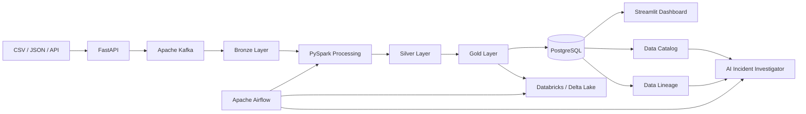

# DataOps Nexus

> A self-service DataOps control platform for building, monitoring, governing, and troubleshooting modern data pipelines.

## Project Status

DataOps Nexus is currently under active development.

| Capability | Status |
|---|---|
| Python project foundation | Implemented |
| Automated code-quality checks | Implemented |
| GitHub Actions CI | Implemented |
| FastAPI ingestion service | Planned |
| PostgreSQL metadata storage | Planned |
| Apache Kafka event streaming | Planned |
| PySpark data processing | Planned |
| Bronze, Silver, and Gold layers | Planned |
| Databricks and Delta Lake | Planned |
| Apache Airflow orchestration | Planned |
| Data Quality framework | Planned |
| Data Catalog | Planned |
| Data Lineage | Planned |
| Monitoring dashboard | Planned |
| AI Pipeline Incident Investigator | Planned |
| Retrieval-Augmented Generation | Planned |

## Overview

DataOps Nexus is a production-inspired Data Engineering platform designed for small data teams.

The platform will allow users to ingest CSV, JSON, and API data, execute scalable pipelines, monitor data quality, inspect lineage, explore metadata, and investigate pipeline failures through an AI-assisted control center.

Unlike a basic ETL project, DataOps Nexus focuses on the complete operational lifecycle of data pipelines:

```text
Ingestion
    ↓
Event Streaming
    ↓
Data Processing
    ↓
Data Quality
    ↓
Medallion Architecture
    ↓
Orchestration
    ↓
Catalog and Lineage
    ↓
Monitoring
    ↓
AI-Assisted Incident Analysis
```

## Core Use Case

A user uploads or registers a dataset.

DataOps Nexus then:

1. Validates the request through FastAPI.
2. Publishes an ingestion event to Apache Kafka.
3. Stores raw data in the Bronze layer.
4. Processes data with PySpark.
5. Cleans, validates, and quarantines invalid records.
6. Produces trusted Silver datasets.
7. Generates business-ready Gold datasets.
8. Registers metadata, quality results, and lineage.
9. Orchestrates workflows through Apache Airflow.
10. Displays pipeline health through a Streamlit dashboard.
11. Uses an AI assistant to explain failures and recommend corrective actions.

## Planned Architecture



## Technology Stack

| Area | Technology |
|---|---|
| Programming language | Python 3.12 |
| Package management | uv |
| API | FastAPI |
| Database | PostgreSQL |
| Event streaming | Apache Kafka |
| Data processing | PySpark |
| Lakehouse | Databricks and Delta Lake |
| Orchestration | Apache Airflow |
| Dashboard | Streamlit |
| Local object storage | MinIO |
| Testing | Pytest |
| Linting and formatting | Ruff |
| Static type checking | MyPy |
| CI/CD | GitHub Actions |
| AI | LLM and RAG |

## Current Quality Gates

Every change is expected to pass:

```bash
uv run ruff check .
uv run ruff format --check .
uv run mypy src tests
uv run pytest
```

The same checks run automatically through GitHub Actions.

## Repository Structure

```text
dataops-nexus/
├── apps/                 # Executable applications
│   ├── api/              # FastAPI service
│   └── dashboard/        # Streamlit interface
├── src/dataops_nexus/    # Shared Python application logic
├── kafka/                # Kafka producers, consumers, and contracts
├── spark/                # PySpark processing jobs
├── databricks/           # Databricks notebooks and job definitions
├── airflow/              # Airflow DAGs
├── data/                 # Local development data layers
├── sql/                  # Schemas, queries, and analytics SQL
├── infrastructure/       # Infrastructure configuration
├── monitoring/           # Monitoring configuration
├── tests/                # Automated tests
├── docs/                 # Technical documentation
├── scripts/              # Development and operational scripts
├── pyproject.toml
├── docker-compose.yml
└── README.md
```

## Local Development

Install the project:

```bash
uv sync
```

Run quality checks:

```bash
uv run ruff check .
uv run ruff format --check .
uv run mypy src tests
uv run pytest
```

Verify the project package:

```bash
uv run python -c "import dataops_nexus; print(dataops_nexus.__file__)"
```

## Development Workflow

```text
Issue
  ↓
Feature Branch
  ↓
Small Commits
  ↓
Automated Checks
  ↓
Pull Request
  ↓
Code Review
  ↓
Merge into main
```

Development is performed through feature branches. Direct changes to `main` are avoided.

## Documentation

Detailed documentation will be stored in:

```text
docs/
├── architecture/
├── adr/
├── diagrams/
└── runbooks/
```

## Roadmap

### Phase 1 — Foundation

- Python 3.12
- uv
- Ruff
- MyPy
- Pytest
- GitHub Actions
- Repository workflow

### Phase 2 — Ingestion

- FastAPI
- File upload
- Request validation
- PostgreSQL metadata

### Phase 3 — Streaming

- Kafka producer
- Kafka consumer
- Event contracts
- Retry and Dead Letter Queue

### Phase 4 — Processing

- PySpark
- Bronze layer
- Silver layer
- Gold layer
- Data quality

### Phase 5 — Lakehouse

- Databricks
- Delta Lake
- Spark SQL
- MERGE and Time Travel

### Phase 6 — Orchestration and Product

- Airflow
- Streamlit
- Data Catalog
- Data Lineage
- Monitoring

### Phase 7 — AI Operations

- AI Pipeline Incident Investigator
- RAG over metadata, lineage, quality results, and logs
- Read-only SQL assistance

## License

This project is licensed under the MIT License.
