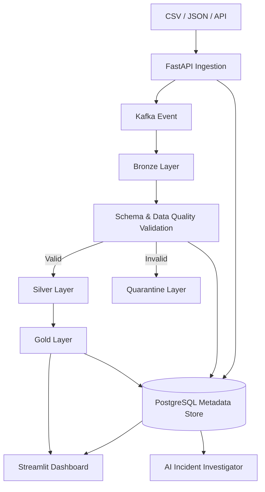

# Data Flow

## Overview

DataOps Nexus uses a layered data-processing model that separates ingestion, raw storage, transformation, validation, curated data, and operational metadata.

## Planned Data Flow

## Processing Stages

### 1. Source Ingestion

Supported sources will initially include:

- CSV
- JSON
- REST API

### 2. API Validation

FastAPI validates ingestion requests before publishing platform events.

### 3. Event Streaming

Kafka decouples ingestion from downstream data processing.

### 4. Bronze Storage

Raw input data is stored without destructive transformation.

### 5. Validation and Data Quality

Records are evaluated against schema and quality rules.

Examples:

- required fields
- data types
- duplicate records
- accepted values
- null thresholds

### 6. Quarantine

Invalid records are isolated rather than silently discarded.

This supports:

- investigation
- correction
- replay
- auditability

### 7. Silver Processing

Valid records are cleaned, standardized, and transformed into trusted datasets.

### 8. Gold Processing

Gold datasets contain analytics-ready or business-ready aggregations.

### 9. Metadata Registration

Pipeline execution and data-quality metadata are stored in PostgreSQL.

### 10. Consumption

Trusted metadata and results are exposed through:

- dashboards
- catalog
- lineage
- monitoring
- AI-assisted incident analysis

## Data Engineering Principle

The platform should preserve enough raw and operational context to support reproducibility, debugging, replay, and auditability.
