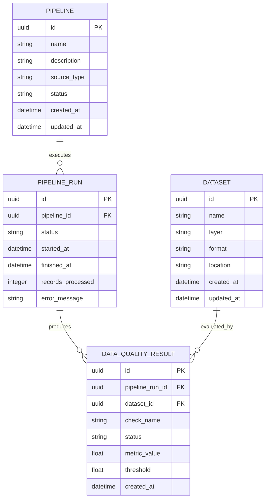

# Core Metadata Model

## Purpose

The DataOps Nexus metadata model defines the core entities required to track data pipelines, datasets, pipeline executions, and data quality results.

It provides the foundation for future PostgreSQL persistence, API services, observability, lineage, monitoring, and AI-assisted incident investigation.

> This document describes the initial domain design. The entities defined here are not yet implemented as database models.

## Core Entities

### Pipeline

Represents a logical data pipeline registered in DataOps Nexus.

**Initial attributes:**

- `id` — unique pipeline identifier
- `name` — human-readable pipeline name
- `description` — optional pipeline description
- `source_type` — type of source used by the pipeline
- `status` — current pipeline status
- `created_at` — creation timestamp
- `updated_at` — last update timestamp

### Dataset

Represents a data asset consumed or produced by a pipeline.

**Initial attributes:**

- `id` — unique dataset identifier
- `name` — dataset name
- `layer` — storage layer
- `format` — data format
- `location` — logical or physical storage location
- `created_at` — creation timestamp
- `updated_at` — last update timestamp

Initial supported layers:

- Raw
- Bronze
- Silver
- Gold
- Quarantine

### PipelineRun

Represents a single execution of a pipeline.

**Initial attributes:**

- `id` — unique run identifier
- `pipeline_id` — pipeline being executed
- `status` — execution status
- `started_at` — execution start timestamp
- `finished_at` — execution completion timestamp
- `records_processed` — number of processed records
- `error_message` — optional execution error information

### DataQualityResult

Represents the result of an individual data quality check associated with a pipeline run and dataset.

**Initial attributes:**

- `id` — unique result identifier
- `pipeline_run_id` — associated pipeline execution
- `dataset_id` — evaluated dataset
- `check_name` — name of the quality check
- `status` — check result status
- `metric_value` — measured value
- `threshold` — configured acceptance threshold
- `created_at` — result creation timestamp

## Relationships

The initial metadata model defines the following relationships:

- One `Pipeline` can have many `PipelineRun` records.
- One `PipelineRun` can produce multiple `DataQualityResult` records.
- One `Dataset` can have multiple `DataQualityResult` records.

## Entity Relationship Diagram

## Design Decisions

### Pipeline and Dataset Relationship

The initial model intentionally avoids a direct foreign-key relationship between `Pipeline` and `Dataset`.

In a real data platform, a dataset may be produced by one pipeline and consumed by one or more downstream pipelines. Modeling a dataset as belonging directly to a single pipeline would therefore create an unnecessary limitation.

The relationship between pipelines and datasets will be introduced in a later lineage-focused iteration using explicit input/output or lineage relationships.

This keeps the initial metadata model small while allowing the architecture to evolve toward many-to-many data dependencies.

## Design Scope

This model intentionally focuses on the minimum metadata required for the first implementation phase.

Future iterations may introduce additional entities for:

- data lineage
- schema versions
- pipeline events
- incidents
- orchestration metadata
- monitoring metrics
- AI-generated incident findings

These capabilities are outside the scope of the initial metadata model.
