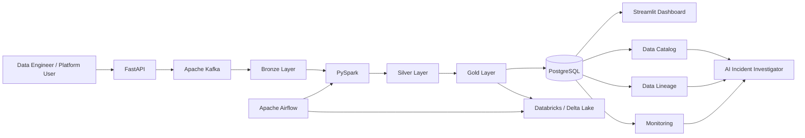

# System Architecture

## Overview

DataOps Nexus is designed as a modular DataOps platform for ingesting, processing, orchestrating, monitoring, governing, and troubleshooting modern data pipelines.

This document describes the planned high-level architecture of the platform.

> **Status:** The architecture below represents the target design. Components that are not yet implemented are developed incrementally through separate issues and pull requests.

## High-Level Architecture

## Component Responsibilities

### FastAPI

Provides the platform API layer.

Responsibilities will include:

- ingestion requests
- pipeline management
- metadata access
- health endpoints
- platform operations

### Apache Kafka

Provides asynchronous event streaming between ingestion and processing components.

Planned responsibilities:

- ingestion events
- pipeline events
- retry processing
- dead-letter events

### Bronze Layer

Stores raw source data with minimal transformation.

Design principle:

> Bronze data remains immutable so pipelines can be replayed or reprocessed from the original input.

### PySpark

Performs scalable data processing and transformation.

Responsibilities will include:

- schema validation
- data cleaning
- deduplication
- enrichment
- aggregation
- data-quality processing

### Silver Layer

Contains cleaned, standardized, validated, and trusted datasets.

Invalid records may be written to a quarantine path for inspection and reprocessing.

### Gold Layer

Contains business-ready datasets and analytical aggregates.

Gold data will be consumed by downstream applications, analytics, and platform services.

### PostgreSQL

Acts as the operational metadata store.

Planned metadata includes:

- pipeline runs
- datasets
- data-quality results
- lineage relationships
- incidents
- AI investigation metadata

### Databricks and Delta Lake

Provide lakehouse processing capabilities.

Planned capabilities include:

- Delta tables
- ACID transactions
- schema enforcement
- MERGE operations
- Time Travel
- Spark SQL analytics

### Apache Airflow

Orchestrates batch and dependency-driven workflows.

Responsibilities will include:

- scheduling
- retries
- task dependencies
- pipeline execution
- operational metadata

### Streamlit Dashboard

Provides the initial self-service user interface.

Planned views include:

- pipeline status
- dataset health
- data-quality metrics
- catalog information
- lineage
- incidents

### Data Catalog

Stores and exposes metadata about datasets.

Examples:

- dataset name
- owner
- source
- schema
- layer
- quality score
- last successful update

### Data Lineage

Tracks upstream and downstream relationships between datasets and pipelines.

### Monitoring

Tracks operational health and performance.

Planned metrics include:

- pipeline success rate
- processing latency
- failed records
- Kafka lag
- data freshness
- quality score

### AI Incident Investigator

Provides AI-assisted analysis of pipeline incidents.

The investigator will use trusted operational context such as:

- pipeline metadata
- error logs
- data-quality results
- lineage
- execution history

The AI component will provide recommendations only and will not directly modify production data.

## Architectural Principles

DataOps Nexus follows these principles:

1. Modular architecture
2. Event-driven ingestion
3. Immutable raw data
4. Idempotent processing
5. Explicit data-quality validation
6. Observable pipelines
7. Metadata and lineage by design
8. Least-privilege access
9. Reproducible environments
10. AI grounded in trusted operational context

## Current Implementation Status

Currently implemented:

- Python 3.12 project foundation
- uv dependency management
- Ruff
- MyPy
- Pytest
- GitHub Actions CI
- repository workflow
- initial project documentation

All remaining architecture components are currently planned.
